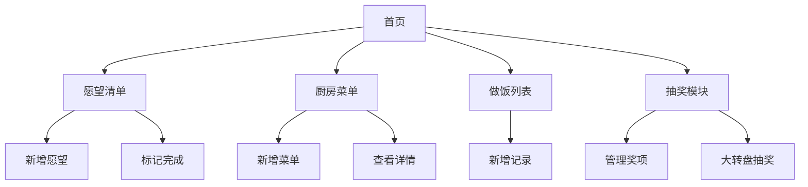

## 1. 产品概述

LLYYDS 是一款专为情侣打造的日常互动APP，提供愿望清单、厨房菜单、做饭记录和趣味抽奖四大核心功能，让情侣的日常生活更有仪式感和趣味性。
- 目标用户：恋爱中的情侣，希望记录和分享日常美好瞬间
- 产品价值：增强情侣互动，记录生活点滴，增添生活乐趣

## 2. 核心功能

### 2.1 用户角色

| 角色 | 使用方式 | 核心权限 |
|------|----------|----------|
| 情侣用户 | 无需注册，直接使用 | 使用所有功能，数据本地存储 |

### 2.2 功能模块

1. **首页**：展示四大功能入口，温馨的情侣主题界面
2. **愿望清单页**：新增、管理、标记完成愿望
3. **厨房菜单页**：添加菜单，图文展示
4. **做饭列表页**：记录做饭时光，上传照片
5. **抽奖页**：设置抽奖选项，大转盘抽奖

### 2.3 页面详情

| 页面名称 | 模块名称 | 功能描述 |
|----------|----------|----------|
| 首页 | 功能导航 | 展示四大功能入口卡片，温馨欢迎语，情侣主题装饰 |
| 首页 | 顶部横幅 | 显示APP名称和日期，浪漫背景 |
| 愿望清单页 | 愿望列表 | 展示所有愿望，区分已完成/未完成状态 |
| 愿望清单页 | 新增愿望 | 弹窗表单，输入愿望名称、描述、设置完成时间、上传照片 |
| 愿望清单页 | 标记完成 | 点击标记愿望已完成，记录完成时间和照片 |
| 厨房菜单页 | 菜单列表 | 瀑布流/卡片式图文展示所有菜单 |
| 厨房菜单页 | 新增菜单 | 弹窗表单，输入菜单名称、上传照片、添加描述 |
| 厨房菜单页 | 菜单详情 | 点击查看菜单大图和详细描述 |
| 做饭列表页 | 做饭记录 | 时间线形式展示做饭记录 |
| 做饭列表页 | 新增记录 | 弹窗表单，选择时间、上传照片、添加备注 |
| 抽奖页 | 大转盘 | 可视化大转盘，点击旋转抽奖 |
| 抽奖页 | 奖项管理 | 添加/删除抽奖选项，自定义奖项内容 |

## 3. 核心流程

### 愿望清单流程
用户进入愿望清单页 → 点击新增按钮 → 填写愿望信息（名称、描述、时间、照片）→ 保存到列表 → 愿望完成后点击标记 → 记录完成状态和完成时间

### 厨房菜单流程
用户进入厨房菜单页 → 点击新增按钮 → 填写菜单信息（名称、照片、描述）→ 保存到列表 → 卡片式展示菜单

### 做饭记录流程
用户进入做饭列表页 → 点击新增按钮 → 选择时间、上传照片、添加备注 → 保存记录 → 时间线展示

### 抽奖流程
用户进入抽奖页 → 管理奖项列表（添加/删除）→ 点击大转盘开始旋转 → 转盘停止显示中奖结果 → 弹窗展示中奖信息

## 4. 用户界面设计

### 4.1 设计风格

- 主色调：温暖粉色 #FF6B8A + 柔和紫色 #B088F9，辅以暖白 #FFF5F7 和浅灰 #F8F8FC
- 按钮风格：圆角胶囊按钮，带柔和阴影，主按钮使用渐变色
- 字体：标题使用圆润可爱的字体，正文使用清晰易读字体
- 布局风格：卡片式布局，底部Tab导航，iOS风格设计
- 图标风格：线性图标，搭配柔和色彩，lucide-react图标库
- 整体风格：温馨浪漫、圆润柔和、iOS原生体验

### 4.2 页面设计概览

| 页面名称 | 模块名称 | UI元素 |
|----------|----------|--------|
| 首页 | 顶部横幅 | 渐变背景、APP名称、日期显示、心形装饰动画 |
| 首页 | 功能导航 | 四个圆角卡片入口，图标+文字，悬浮阴影效果 |
| 愿望清单页 | 愿望列表 | 卡片列表，未完成/已完成分区，勾选动画 |
| 愿望清单页 | 新增弹窗 | 底部弹出表单，输入框+日期选择+图片上传 |
| 厨房菜单页 | 菜单列表 | 双列瀑布流卡片，图片+名称+描述 |
| 厨房菜单页 | 新增弹窗 | 底部弹出表单，图片上传+名称+描述输入 |
| 做饭列表页 | 记录列表 | 时间线布局，左侧时间轴+右侧卡片 |
| 做饭列表页 | 新增弹窗 | 底部弹出表单，时间选择+图片上传+备注 |
| 抽奖页 | 大转盘 | 圆形转盘，彩色扇形分区，中心按钮 |
| 抽奖页 | 奖项管理 | 标签式列表，添加/删除按钮 |

### 4.3 响应式设计

- 移动优先设计，适配iPhone屏幕尺寸（375px-428px宽度）
- 支持触摸操作，按钮和交互区域足够大（最小44px）
- 底部Tab栏固定，内容区域可滚动
- PWA支持，可添加到iPhone主屏幕，全屏体验

### 4.4 动效设计

- 页面切换：左右滑动过渡
- 卡片交互：点击缩放反馈
- 愿望完成：勾选动画+撒花效果
- 大转盘：旋转缓动动画
- 新增弹窗：底部滑入动画
