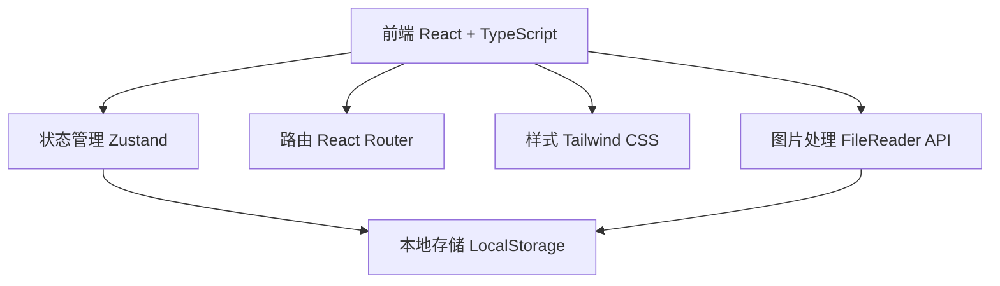
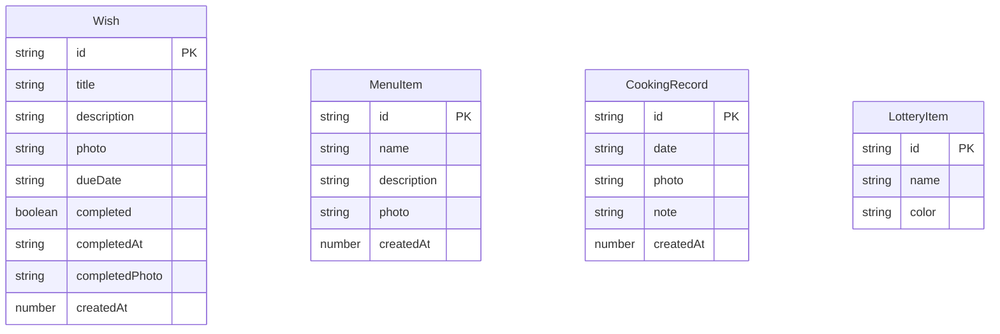

## 1. 架构设计



纯前端架构，数据存储在浏览器 LocalStorage 中，图片使用 Base64 编码存储。无需后端服务。

## 2. 技术说明

- 前端：React@18 + TypeScript + Tailwind CSS@3 + Vite
- 初始化工具：vite-init
- 后端：无（纯前端应用）
- 数据库：LocalStorage（浏览器本地存储）
- 状态管理：Zustand
- 路由：React Router DOM v6
- 图标：lucide-react

## 3. 路由定义

| 路由 | 用途 |
|------|------|
| / | 首页，展示功能入口 |
| /wishes | 愿望清单页 |
| /menu | 厨房菜单页 |
| /cooking | 做饭列表页 |
| /lottery | 抽奖模块页 |

## 4. 数据模型

### 4.1 数据模型定义



### 4.2 数据定义

```typescript
interface Wish {
  id: string;
  title: string;
  description: string;
  photo: string;
  dueDate: string;
  completed: boolean;
  completedAt: string;
  completedPhoto: string;
  createdAt: number;
}

interface MenuItem {
  id: string;
  name: string;
  description: string;
  photo: string;
  createdAt: number;
}

interface CookingRecord {
  id: string;
  date: string;
  photo: string;
  note: string;
  createdAt: number;
}

interface LotteryItem {
  id: string;
  name: string;
  color: string;
}
```

## 5. 组件结构

```
src/
├── components/
│   ├── Layout/
│   │   ├── TabBar.tsx          # 底部导航栏
│   │   └── PageHeader.tsx      # 页面顶部标题栏
│   ├── WishCard.tsx            # 愿望卡片组件
│   ├── MenuCard.tsx            # 菜单卡片组件
│   ├── CookingCard.tsx         # 做饭记录卡片组件
│   ├── SpinWheel.tsx           # 大转盘组件
│   ├── AddWishModal.tsx        # 新增愿望弹窗
│   ├── AddMenuModal.tsx        # 新增菜单弹窗
│   ├── AddCookingModal.tsx     # 新增做饭记录弹窗
│   └── LotteryManager.tsx      # 奖项管理组件
├── pages/
│   ├── Home.tsx                # 首页
│   ├── Wishes.tsx              # 愿望清单页
│   ├── Menu.tsx                # 厨房菜单页
│   ├── Cooking.tsx             # 做饭列表页
│   └── Lottery.tsx             # 抽奖页
├── store/
│   ├── useWishStore.ts         # 愿望数据状态
│   ├── useMenuStore.ts         # 菜单数据状态
│   ├── useCookingStore.ts      # 做饭记录状态
│   └── useLotteryStore.ts      # 抽奖数据状态
├── utils/
│   └── storage.ts              # LocalStorage工具函数
├── App.tsx                     # 应用入口
└── main.tsx                    # 渲染入口
```

## 6. 关键技术实现

### 6.1 图片上传与存储
- 使用 HTML5 FileReader API 读取图片文件
- 将图片转为 Base64 编码字符串
- 存储到 LocalStorage 中
- 限制图片大小，压缩后存储

### 6.2 大转盘实现
- 使用 Canvas 绘制转盘
- CSS transform rotate 实现旋转动画
- 缓动函数实现减速停止效果
- 根据奖项数量动态计算扇形角度

### 6.3 PWA 支持
- 添加 manifest.json 配置
- 设置 apple-mobile-web-app-capable
- 添加启动图标和启动画面
- 支持添加到主屏幕
